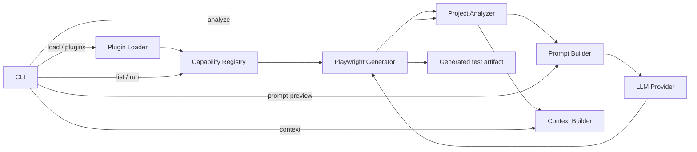

# AI-QE OS

AI-QE OS is an open-source, TypeScript-based Quality Engineering platform for building composable, AI-assisted testing capabilities. Its first end-to-end workflow analyzes an existing Playwright project, assembles relevant project context, constructs a test-generation prompt, and writes a generated Playwright test artifact through a configurable LLM provider.

## Why AI-QE OS?

Quality Engineering tools are often delivered as isolated scripts or tightly coupled products. AI-QE OS explores a plugin-oriented alternative: capabilities implement a shared contract, register with a central registry, and reuse platform services such as project analysis, context selection, prompt construction, and LLM access. This design makes it possible to add future capabilities—failure analysis, accessibility auditing, flaky-test detection, and more—without rebuilding the surrounding CLI and infrastructure.

## Architecture



The default provider is deterministic and local (`mock`). An OpenAI Responses API adapter and environment-based provider selection are implemented, but live OpenAI generation has not yet been validated in this project.

## Current Features

- Typed capability SDK and duplicate-safe capability registry.
- Centralized plugin loader with built-in plugin metadata and an external-plugin extension point.
- `list` and `run` CLI commands for discovering and executing capabilities.
- Recursive Playwright project analysis for config, page objects, fixtures, and test files.
- Bounded context selection, configurable file truncation, and estimated token counts.
- Context-aware Playwright prompt construction using existing project conventions.
- Deterministic mock LLM provider for local development without credentials or network calls.
- End-to-end Playwright generation that writes `generated/generated.spec.ts` by default.
- Optional OpenAI provider adapter using the official SDK and Responses API; live API validation is pending.

## Roadmap

- [x] Capability SDK and registry
- [x] CLI discovery and capability execution
- [x] Playwright project analyzer
- [x] Context builder and token estimation
- [x] Playwright prompt builder
- [x] Mock LLM provider
- [x] End-to-end generated test artifact
- [x] OpenAI provider adapter and environment-based selection
- [ ] Validate generation against the live OpenAI API
- [ ] Add automated unit and integration test coverage
- [ ] Add generated-code validation and repair
- [ ] Add failure analysis and flaky-test detection capabilities
- [ ] Add accessibility and API testing capabilities

## Getting Started

Install dependencies and create a local environment file:

```bash
npm install
cp .env.example .env
npm run typecheck
npm run dev -- list
```

The example environment defaults to `LLM_PROVIDER=mock`, so no API key is required for the local pipeline.

### Example Commands

```bash
npm run dev -- analyze ~/pw-fifa
npm run dev -- context ~/pw-fifa
npm run dev -- prompt-preview ~/pw-fifa --request "Generate a login test"
npm run dev -- run playwright-generator --project ~/pw-fifa --request "Generate a login test"
```

Use `--output <path>` with `run` to override the default `./generated` directory.

### Example Output

List registered capabilities:

```text
AI-QE OS

- Playwright Test Generator (playwright-generator) v0.1.0
```

Analyze a Playwright project:

```text
Playwright config: playwright.config.ts
Number of page objects: 2
- pages/LoginPage.ts
- pages/HomePage.ts
Number of fixtures: 1
- fixtures/auth.fixture.ts
Number of tests found: 3
- tests/login.spec.ts
- tests/navigation.spec.ts
- tests/profile.spec.ts
```

Generate a test with the default mock provider:

```text
Capability: Playwright Test Generator
Status: Success
Summary: Generated a Playwright test with mock/mock-playwright-0.1.
Warnings:
- None
Generated:
generated/generated.spec.ts
```

## Project Structure

```text
apps/cli/                              Command-line interface
packages/capability-sdk/               Shared capability contracts
packages/core/                         Capability registry
packages/project-analyzer/             Playwright project discovery
packages/context-builder/              Bounded context and token estimates
packages/llm/                          Mock and OpenAI provider adapters
packages/capabilities/
  playwright-generator/                Prompt builder and generation pipeline
```

## Security

Never commit `.env`. It may contain API credentials and is intentionally ignored by Git. Commit only `.env.example`, keep secrets out of prompts and generated artifacts, and review generated tests before running them against real systems.

## License

Licensed under the ISC License.
