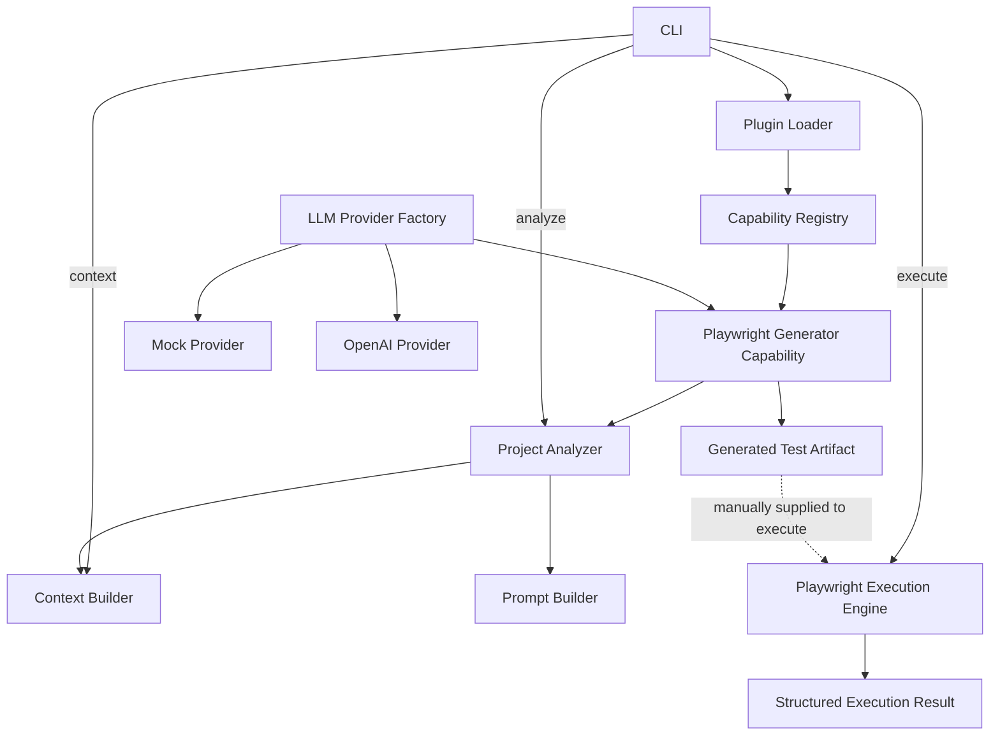

# AI-QE OS

AI-QE OS is a TypeScript-based, plugin-oriented Quality Engineering platform. It analyzes existing Playwright projects, builds project-aware prompts, routes generation through configurable LLM providers, writes generated test artifacts into the target project, and executes Playwright tests with structured result collection.

## Why AI-QE OS?

Quality-engineering automation often grows as isolated scripts tied to one repository or provider. AI-QE OS separates reusable capabilities from the CLI and infrastructure around them, so generation, analysis, execution, and future workflows can evolve as plugins. The same foundation can support failure analysis, self-healing test experiments, API test generation, and accessibility testing without turning the CLI into a monolith.

## Architecture



The generation and execution commands are deliberately separate today. The Context Builder is available through the `context` command; generation currently builds its prompt directly from Project Analyzer output.

## Current Features

- TypeScript CLI with `list`, `plugins`, `run`, `analyze`, `context`, `config-check`, `prompt-preview`, `llm-test`, and `execute` commands
- Capability SDK and registry for typed, reusable capabilities
- Built-in Plugin Loader that keeps capability registration out of the CLI
- Recursive Playwright project analysis for configuration, fixtures, page objects, and tests
- Context selection, per-file truncation, character counts, and estimated token counts
- Project-aware Playwright prompt construction
- YAML project configuration validated with Zod
- Deterministic mock LLM provider for local development
- OpenAI provider implemented with the official SDK, Responses API, configurable models, and transient-failure retries
- Environment and project-configuration provider selection, with `LLM_PROVIDER` taking priority
- End-to-end mock-provider Playwright test generation
- Generated output resolved safely inside the target project and preferably under Playwright's configured `testDir`
- Playwright execution via a spawned `npx playwright test` process
- Structured JSON report parsing with test totals, pass/fail/skip counts, output capture, duration, and report path

### Verification status

- Mock-provider generation has been exercised successfully during development.
- Path resolution and JSON report parsing are covered by unit tests.
- The execution engine is implemented and type-checked, but this repository's automated tests do not run a real external Playwright project.
- The OpenAI provider is implemented and type-checked. It does not have a dedicated unit test, and a live OpenAI request has not been verified in this repository.

## Roadmap

### Completed

- [x] TypeScript project foundation
- [x] CLI
- [x] Capability SDK
- [x] Capability Registry
- [x] Built-in Plugin Loader
- [x] Playwright Project Analyzer
- [x] Context Builder
- [x] Prompt Builder
- [x] YAML project configuration
- [x] Mock LLM Provider
- [x] OpenAI Provider implementation
- [x] Playwright Test Generator
- [x] Generated test artifact creation
- [x] Playwright Execution Engine
- [x] Structured execution results
- [x] Unit tests for execution path resolution and report parsing

### In Progress

- [ ] Live OpenAI API integration verification
- [ ] Generated-code validation and sanitization
- [ ] Prompt-quality improvements

### Planned

- [ ] AI Failure Analyzer
- [ ] Screenshot, trace, and video collection
- [ ] Console and network-log collection
- [ ] Self-healing locator suggestions
- [ ] Automatic retry with repaired tests
- [ ] Flaky-test detection
- [ ] API test generation
- [ ] Accessibility analysis
- [ ] GitHub Actions integration
- [ ] Pull-request test recommendations
- [ ] External plugin support

## Getting Started

Requirements: a current Node.js release and npm. Test execution also requires Playwright to be installed in the target project.

```bash
git clone <repository-url>
cd AI-QE-OS
npm install
cp .env.example .env
cp project.example.yml project.yml
npm run typecheck
npm test
npm run dev -- list
```

Before using project-aware commands, replace the placeholder root in `project.yml` with the path to your Playwright project.

### Example commands

```bash
npm run dev -- plugins
npm run dev -- list
npm run dev -- analyze /path/to/playwright/project
npm run dev -- context /path/to/playwright/project
npm run dev -- prompt-preview /path/to/playwright/project --request "Generate a login test"
npm run dev -- run playwright-generator --request "Generate a login test"
npm run dev -- execute tests/generated/generated.spec.ts --project /path/to/playwright/project
```

CLI values override YAML values. For `run`, omit `--project` or `--output` to use the corresponding `project.yml` value.

## Configuration

Environment variables select the provider and supply OpenAI credentials. Keep `.env` local:

```dotenv
LLM_PROVIDER=mock
OPENAI_API_KEY=
OPENAI_MODEL=
OPENAI_MAX_RETRIES=2
```

`project.yml` controls the project, generation, and context defaults:

```yaml
project:
  name: sample-playwright-project
  root: /path/to/playwright/project

llm:
  provider: mock
  model: mock-playwright-0.1

generation:
  outputDirectory: ./tests/generated

context:
  maxPageObjects: 5
  maxFixtures: 5
  maxTests: 3
  maxCharactersPerFile: 12000
```

Provider precedence is `LLM_PROVIDER`, then `project.yml`, then `mock`. When `openai` is selected, `OPENAI_API_KEY` and a model from `OPENAI_MODEL` or YAML configuration are required.

Validate configuration with:

```bash
npm run dev -- config-check
npm run dev -- config-check --config ./project.yml
```

## Example Output

### Plugins

```text
Loaded plugins:
- Playwright Generator Plugin (builtin.playwright-generator) v0.1.0
```

### Capabilities

```text
AI-QE OS

- Playwright Test Generator (playwright-generator) v0.1.0
```

### Project analysis

```text
Playwright config: playwright.config.ts
Number of page objects: 2
- pages/login-page.ts
- pages/home-page.ts
Number of fixtures: 1
- fixtures/auth.fixture.ts
Number of tests found: 2
- tests/login.spec.ts
- tests/navigation.spec.ts
```

### Generation

```text
Capability: Playwright Test Generator
Status: Success
Summary: Generated a Playwright test with mock/mock-playwright-0.1.
Warnings:
- None
Generated:
/path/to/playwright/project/tests/generated/generated.spec.ts
```

### Execution

```text
Test file: /path/to/playwright/project/tests/generated/generated.spec.ts
Status: PASS
Exit code: 0
Duration: 1842 ms
Report: /path/to/playwright/project/test-results/ai-qe-os/playwright-report.json
Total: 3
Passed: 3
Failed: 0
Skipped: 0
```

Exact counts, paths, duration, and Playwright output depend on the target project.

## Project Structure

```text
apps/
  cli/                         Command-line interface
packages/
  capability-sdk/              Capability contracts and registry
  capabilities/
    playwright-generator/      Analyzer-to-artifact generation capability
  context-builder/             Context selection and size estimation
  core/                        YAML configuration and built-in Plugin Loader
  execution-engine/            Playwright process execution and report parsing
  llm/                         Provider contracts, factory, mock, and OpenAI providers
  project-analyzer/            Playwright project discovery and file reading
project.example.yml            Safe project configuration template
.env.example                   Safe environment variable template
```

## Testing

Run the repository checks with:

```bash
npm run typecheck
npm test
```

The test suite covers generated-test path resolution and Playwright JSON report parsing. Provider calls and real target-project Playwright execution are not part of the automated suite.

## Current Limitations

- External plugin discovery is not implemented; the loader currently registers built-in plugins only.
- Generation and execution are separate commands; generated tests are not run automatically.
- The Context Builder is not yet wired into the generator pipeline.
- Playwright `testDir` detection supports common static configuration forms, not arbitrary runtime expressions.
- Real OpenAI requests require API billing, a valid API key, model access, and network availability.
- Live OpenAI generation has not yet been verified.
- Automatic failure analysis is not yet implemented.
- Screenshot, trace, video, console, and network analysis are not yet implemented.
- JSON report parsing is tolerant of missing or malformed reports, but HTML report integration is not implemented.

## Security

Never commit `.env` or API keys. `project.yml` is also ignored because it can contain local or machine-specific paths. Commit only `.env.example` and `project.example.yml`, keeping both free of credentials and personal filesystem paths.

## License

This project is licensed under the ISC License.
